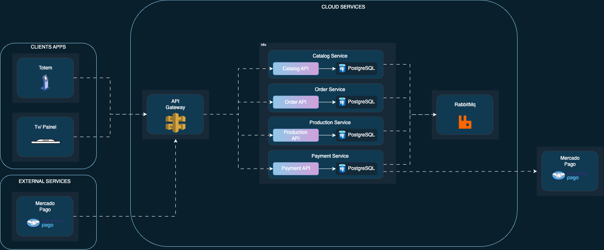
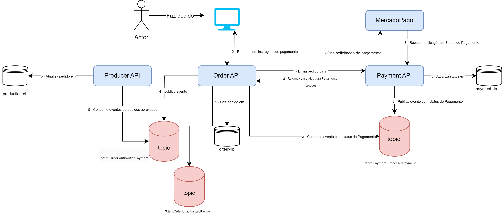

# Fiap Tech Challenge - Order API
Esse microsserviço é reponsável por realizar os pedidos do sistema Totem

## Technologies / Components implemented

- .NET 6
    - ASP.NET MVC Core
    - ASP.NET WebApi 
    - Background Services

- Components / Services
    - RabbitMQ
    - PostgreSQL


## Diagram



## OWASP ZAP
Executado a ferramente OWASP ZAP nos seguintes fluxos:
- Listar/exibir catalogo
- Realização do Pedido (checkout)
- Geração e confirmação de Pagamento
  
[Report](https://ecsj.github.io/Totem.Order.API/ZapReport/ZAP-Report-.html)

Como não foi identificado vulnerabilidades altas, não foi gerado um novo relatório

## SAGA

O padrão Saga Coreografado foi escolhido devido à sua simplicidade de implementação, permitindo que cada equipe desenvolva um serviço sem necessidade de conhecimento sobre a implementação dos outros. Outro aspecto crucial na escolha foi o acoplamento fraco, já que cada serviço publica e consome eventos, possibilitando o desenvolvimento independente de cada um.



## Fluxo de Pedido

1. **Finalização do Pedido no Totem**
   - O cliente finaliza a escolha no Totem.

2. **Recebimento do Pedido pela OrderAPI**
   - A OrderAPI recebe o pedido.
   - Após validações, faz uma requisição para a API de pagamento.
   - Após receber a resposta da API de pagamento, atualiza os detalhes de pagamento, como o QR Code, no banco de dados e salva a transação no banco de dados.

3. **Notificação de Pagamento**
   - Após o pagamento do cliente, a API de Pagamentos recebe uma notificação via webhook do Mercado Pago com o status do pagamento.

4. **Processamento da Notificação de Pagamento**
   - Após receber a notificação de pagamento, a OrderAPI é notificada.
   - A OrderAPI atualiza o status do pagamento no banco de dados.
   - Se o status do pagamento for aprovado, o status do pedido é atualizado para "Pagamento Autorizado" e um evento de "Pagamento Autorizado" é publicado.
   - Se o status do pagamento for reprovado, o status do pedido é atualizado para "Pagamento Não Autorizado" e um evento de "Pagamento Não Autorizado" é publicado.


5. **Notificação de pedidos**
   - Após OderAPI receber o evento com o status de Pagamento, é publicado um evento para notificação dos clientes
   - API de notificação não foi implementada nesta etapa por não ter um FrontEnd, porem o cliente também é notificado pelo proprio totem ao finalizar pagamento

6. **Persistência dos Eventos**
   - Após a publicação dos eventos, a transação é salva no banco de dados.
   - Em caso de algum problema nesta etapa, a mensagem volta para a fila do RabbitMQ para posterior processamento.

## Relatório de Impacto à Proteção de Dados Pessoais


[RIPD.docx](https://ecsj.github.io/Totem.Order.API/RIPD.docx)

## Rodando a API em localhost
1. Instale o Docker: [www.docker.com/](https://www.docker.com/get-started/)
- Após instalado confira se o docker está em execução:

 ```sh
docker ps
 ```

2. Clone este repositório para o seu ambiente local.

3. Navegue até o diretório raiz do projeto.

4. No terminal, execute o seguinte comando para fazer o build e subir todos serviços:

 ```sh
docker build -t totem-order-api .
docker compose up -d
 ```

Agora basta abrir /swagger
Ficando assim: http://localhost:5010/swagger

5. Antes de executar o fluxo completo é necessario fazer o build de todas apis:
Totem Order API: https://github.com/ecsj/Totem.Order.API
 ```sh
docker build -t totem-order-api .
 ```
Totem Catalog API: https://github.com/ecsj/Totem.Api.Catalog
 ```sh
docker build -t totem-catalog-api .
 ```
Totem Payment API: https://github.com/ecsj/Totem.Api.Payment
 ```sh
docker build -t totem-payment-api .
 ```
Totem Production API: https://github.com/ecsj/Totem.Api.Production
 ```sh
docker build -t totem-production-api .
 ```

Por fim, executar todos serviços:

 ```sh
docker compose up -d
 ```

## Processo de criação de Produtos


```
curl -X 'POST' \
  'http://localhost:5002/Product' \
  -H 'accept: text/plain' \
  -H 'Content-Type: application/json' \
  -d '{
    "name": "Coca cola",
    "price": 9.99,
    "description": "",
    "category": 2,
    "imageURL": "https://picsum.photos/200/300"
}'
```


Categoria de produtos:

0 - Lanche,
1 - Acompanhamento,
2 - Bebida,
3 - Sobremesa

## Processo de criação de Pedidos (checkout)


```
curl -X 'POST' \
  'http://localhost:5010/Order' \
  -H 'accept: */*' \
  -H 'Content-Type: application/json' \
  -d '{
  "products": [
    {
      "productId": "38935d22-41e1-44c4-9da3-b356f4b9e0d0",
      "quantity": 1,
      "total": 10,
      "comments": "string"
    }
  ],
  "total": 10
}'
```


Status de pagamentos:
0 - Pending
1 - Approved
2 - Declined


## Observações

Essa api não tem implementacao de sistema de pagamento.
Foi utilizado apenas um fake Service retornando true, sempre que tiver um novo pedido.
